
<h1 align="center">电影订票及评论网站的设计与实现</h1>

## 简介
电影订票及评论网站：角色分为管理员和用户；功能包括订票、电影评论、用户充值、订单管理、评论管理和公告信息管理，支持多种支付方式及后台管理功能，采用Spring Boot框架。    --计算机毕业设计源码；毕设源码；java毕业设计源码

## 联系方式

<h3 align="center">获取完整代码与数据库文件 + 微信：deepguan QQ: 86050149 QQ群: 783742310</h3>

<h3 align="center">可帮忙远程部署 包运行成功！提供远程部署、修改代码、设计文档指导、代码讲解等服务！</h3>

## 功能介绍（完整见运行截图）
管理员：管理员可以通过后台管理界面进行网站的整体管理，包括电影管理、公告信息管理、用户评论管理等。主要功能包括查看和管理影片信息、评论审核和删除、网站各类公告发布和更新。管理员还可以通过搜索功能快速定位和处理相关数据，同时具备新增、修改和删除电影信息、评论及公告内容的权限。管理界面提供各功能模块的快速访问，如个人中心和管理员管理，确保高效运营。  
  
用户：用户可以在前台界面浏览和交互，包括电影浏览、订票、查看订单详情、评论及点赞踩等操作。核心功能包括通过筛选日期和座位选择进行票务订购，查看票务订单细节及进行退款和评价。用户可在个人中心管理个人信息和订单记录，同时用户可通过导航栏快速切换至首页、电影列表和公告信息。充值功能提供充值金额选择和多种支付方式支持，为用户提供便捷的消费体验。

## 运行截图

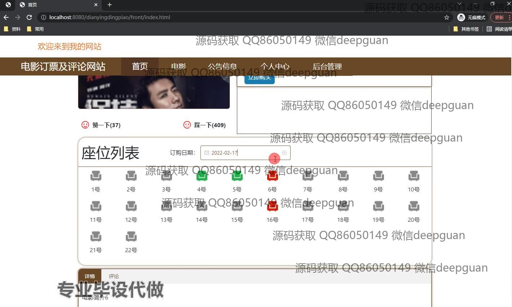
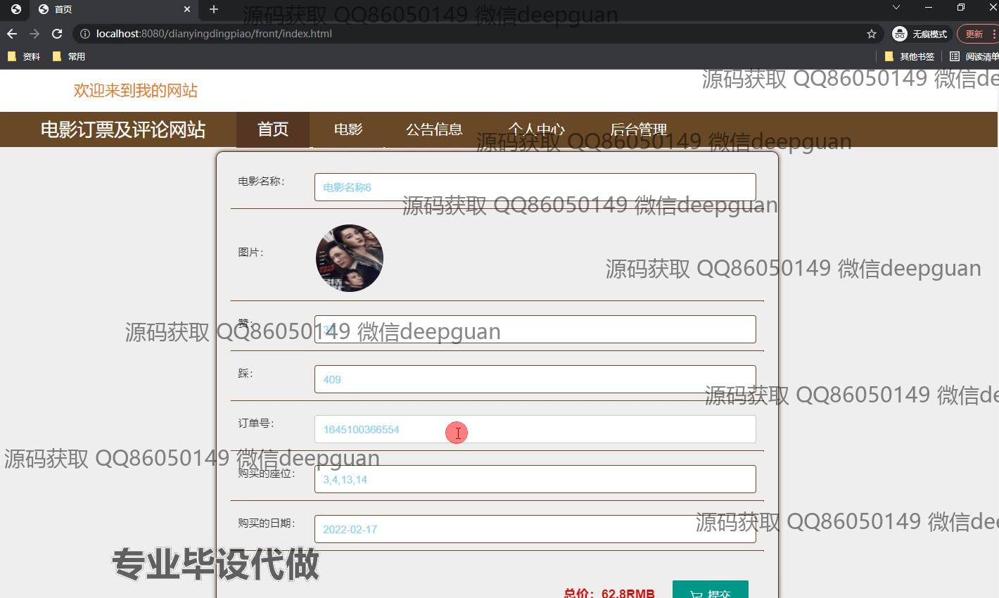
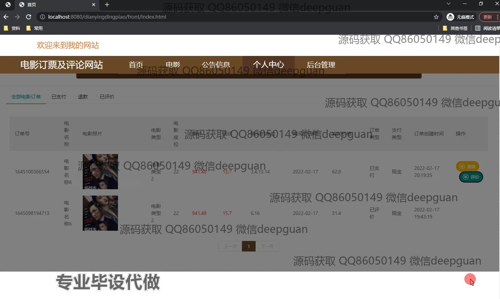
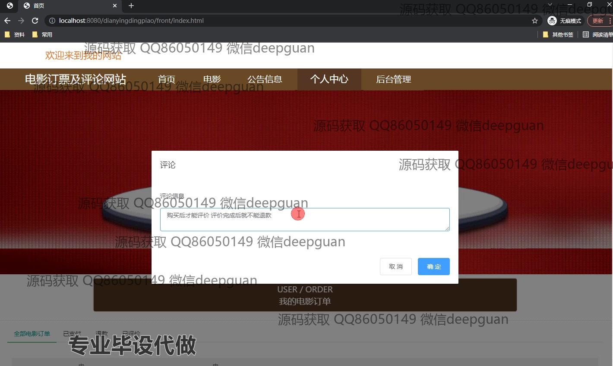
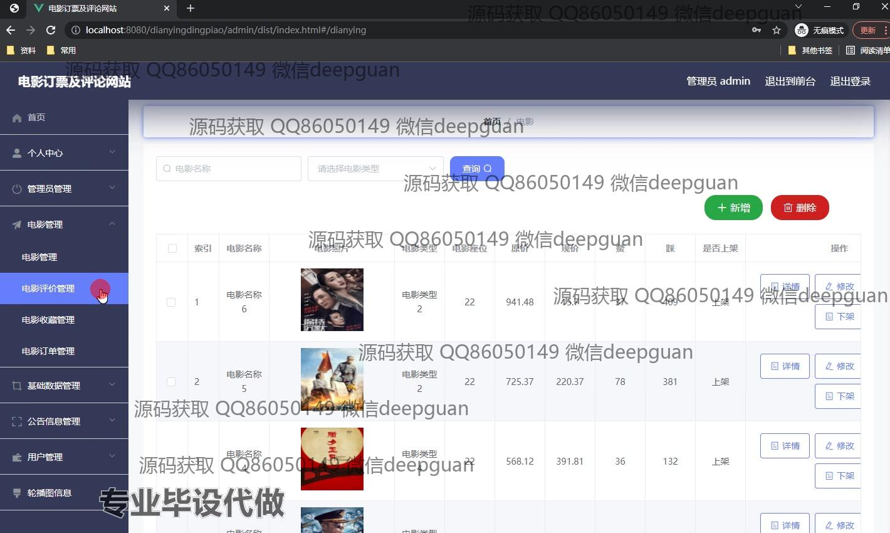
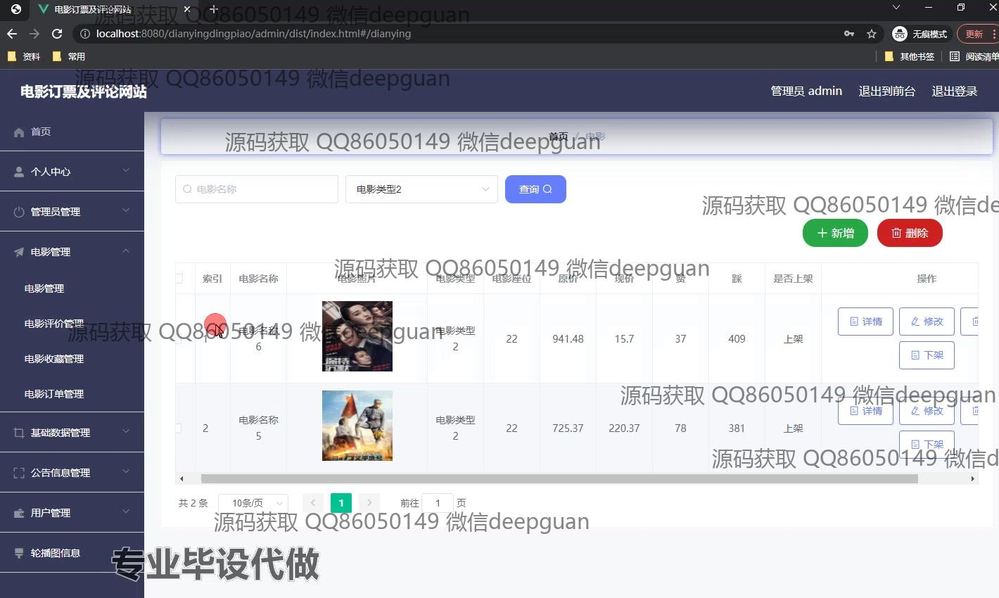
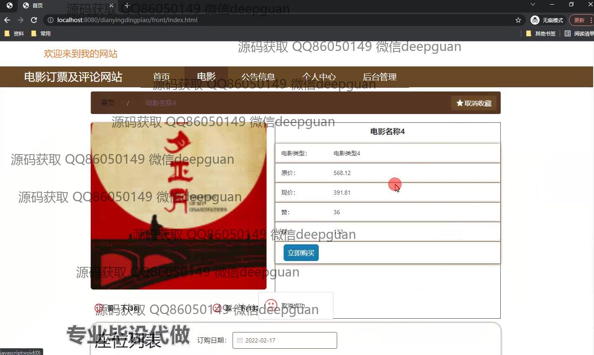
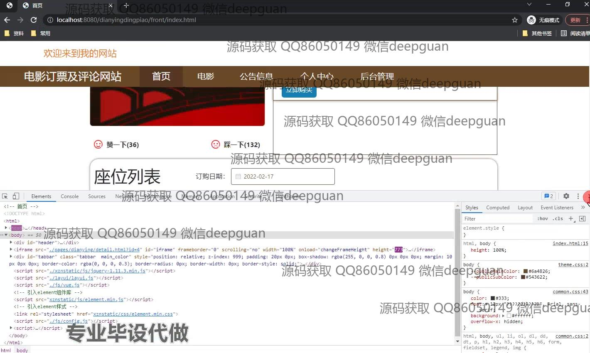
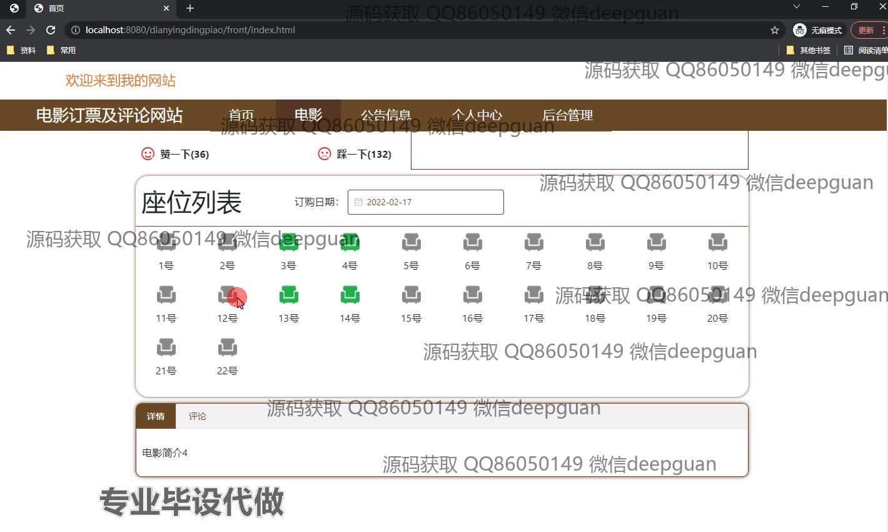
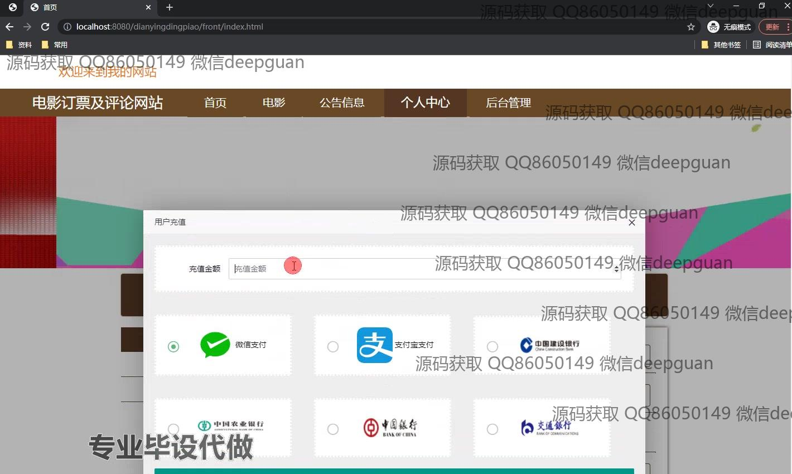
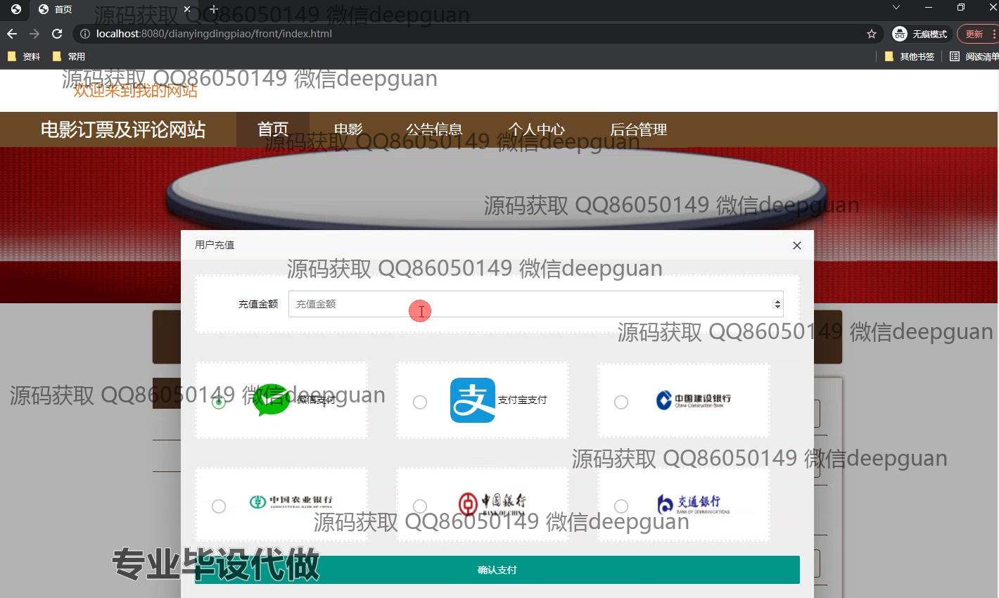
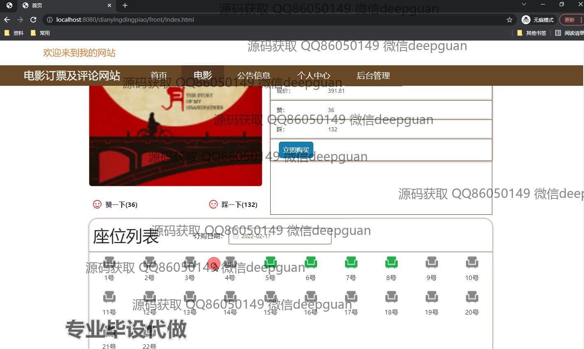
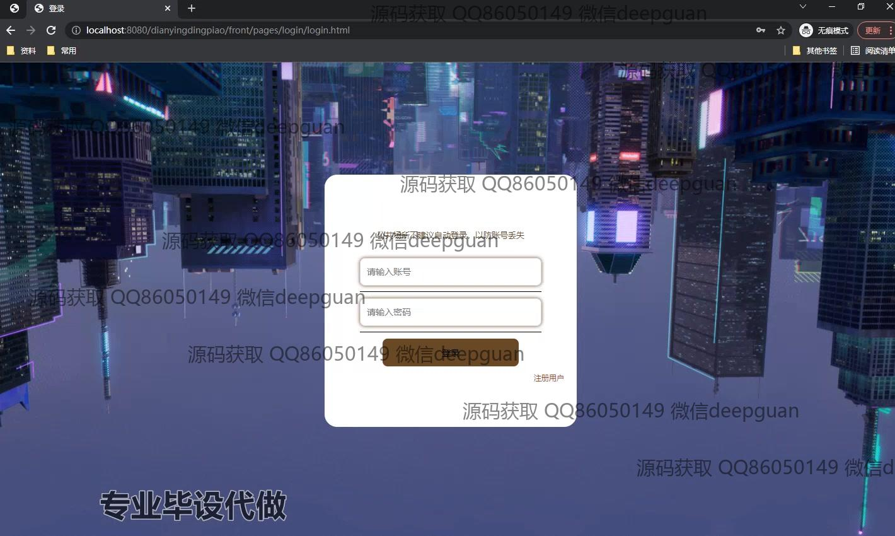
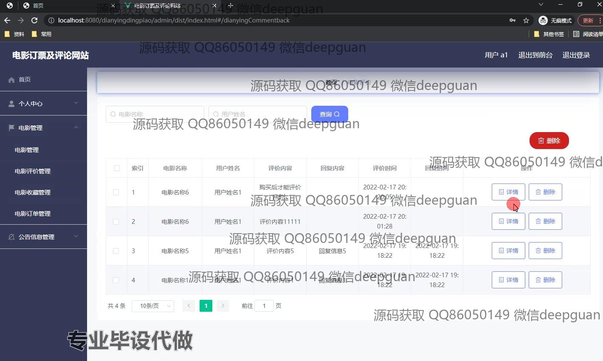

本代码来源于网络,仅供学习参考使用!

